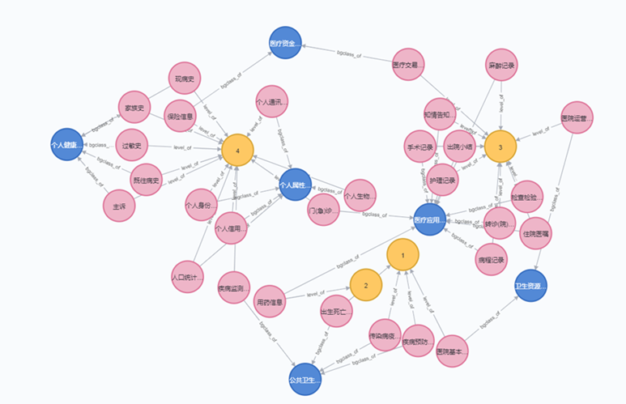
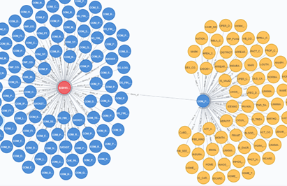
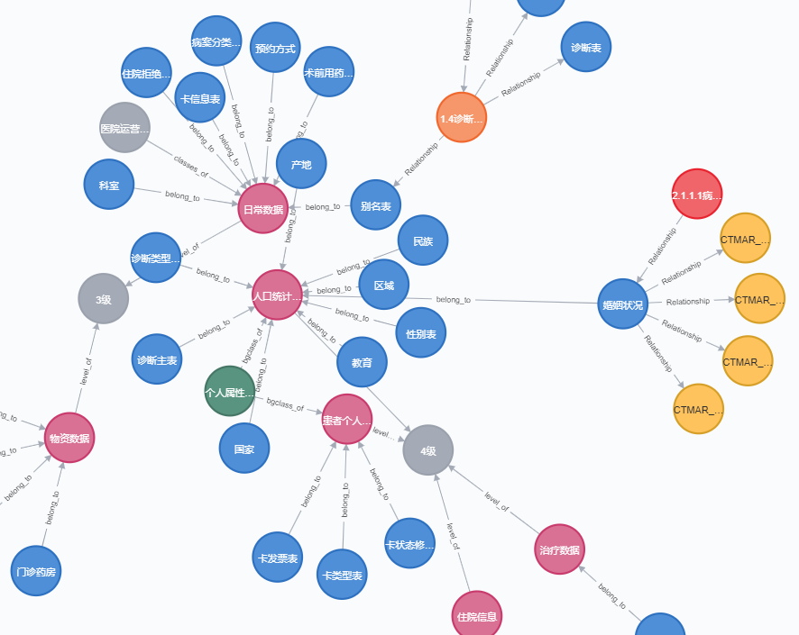

## 图谱形式的数据分类分级

每个行业都有自己的一些数据分类分级标准，而将自己的数据资产按这个标准进行分类管理，往往工作量极为巨大，而本项目借助知识图谱和nlp的一些手段尽量去简化和自动化的进行数据的归类与管理，大概思路如下：

1、通过行业的数据分类分级标准，结合实际数据制定分类标准图谱，如下：

2、通过扫描数据资产，构建数据资产图谱，如下：

3、通过nlp的一些算法将两个图谱进行关联，从而达到分类分级的目的。

主要的一些脚本的功能如下：

datas：存放了一些数据

gldata_fx：数据的一些分析处理脚本（分词、聚类等）

match_res：词义匹配的相似度等结果

config文件：词义匹配的字典、图数据库连接信息、分类标准和资产信息的存放路径

graph.py：通过js文件字典去构建图谱，内部实现了从不同逻辑结构去搭建图谱的方法

kwpb.py：词义匹配的主要核心代码

mc_fx.py：分词和词汇翻译的一些方法

neo4j.py：图数据库neo4j数据查询的一些方法

main.py：导入分类标准图谱、数据资产信息图谱、进行自动关联
